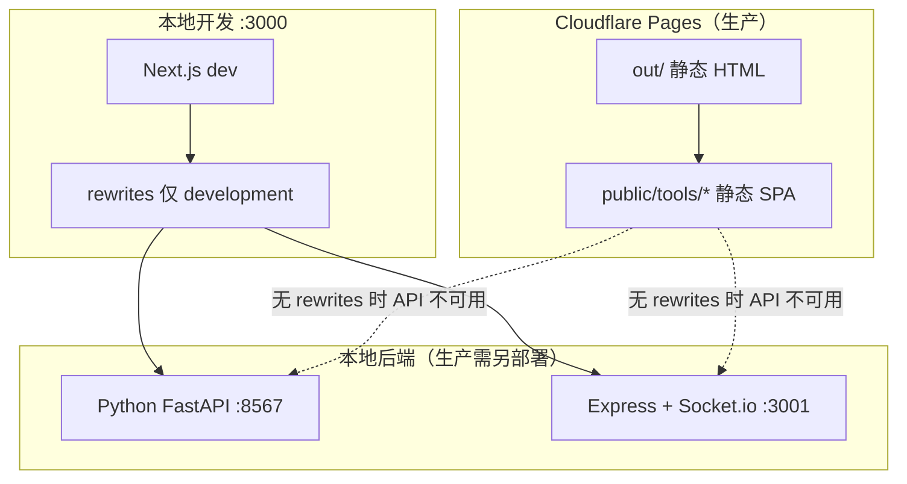

# 个人网站架构总览

> 文档生成：2026-06-20  
> 仓库：`my-portfolio` — Next.js 16 双语个人作品集，内嵌两个可独立运行的子项目（AI 文章、Insight Radar）。

本文档描述**当前代码库的完整架构**，便于在新窗口或新会话中快速恢复上下文。Demo 无后端简化版**暂未实施**（已讨论、待确认后再做）。

---

## 1. 系统全景



| 层级 | 技术 | 职责 |
|------|------|------|
| **作品集主站** | Next.js 16 + React 19 + Tailwind 4 | 首页、项目详情、静态导出 |
| **AI 文章前端** | Vue 3 + Vite + Ant Design Vue | 构建到 `public/tools/ai-article/` |
| **AI 文章后端** | Python FastAPI + SQLite + Redis | 多 Agent 写作、SSE 进度 |
| **Insight 前端** | React + Vite + Tailwind | 构建到 `public/tools/insight-radar/` |
| **Insight 后端** | Express + Prisma + Socket.io | 热点抓取、AI 过滤、实时推送 |

---

## 2. 仓库目录结构

```
my-portfolio/
├── src/                          # Next.js 主站源码
│   ├── app/                      # App Router 页面
│   ├── components/               # UI 与区块组件
│   ├── content/                  # 内容与项目数据
│   └── lib/                      # i18n、工具函数
├── public/                       # 静态资源 + 工具构建产物
│   ├── tools/ai-article/         # Vue 构建输出（勿手改）
│   ├── tools/insight-radar/      # React 构建输出（勿手改）
│   ├── projects/                 # 项目封面、架构图等
│   └── _redirects                # Cloudflare 工具路径重写
├── python-backend/               # AI 文章 Python 后端 + Vue 前端源码
│   ├── app/                      # FastAPI 应用
│   └── ai-passage-creator/       # Vue SPA 源码
├── insight-radar/                # Insight Radar  monorepo 片段
│   ├── client/                   # React 前端源码
│   └── server/                   # Express 后端源码
├── docs/                         # 架构与部署文档
├── out/                          # next build 静态导出（gitignore）
├── next.config.ts
├── package.json
└── tsconfig.json                 # exclude: insight-radar, python-backend
```

---

## 3. 主站（Next.js）架构

### 3.1 构建模式

| 配置 | 值 | 说明 |
|------|-----|------|
| `output` | `'export'` | 生产构建输出 `out/`，适配 Cloudflare Pages |
| `trailingSlash` | `true` | URL 带尾斜杠，如 `/projects/ai-article/` |
| `images.unoptimized` | `true` | 静态导出要求 |
| `rewrites` | **仅 `NODE_ENV === 'development'`** | 本地 dev 代理 API；**生产 build 不含 rewrites** |

### 3.2 路由表

| 路径 | 类型 | 说明 |
|------|------|------|
| `/` | 静态 | 单页首页，多个 anchor 区块 |
| `/projects/` | 静态 | 项目列表（与首页卡片相同数据源） |
| `/projects/[slug]/` | SSG | `generateStaticParams` 预生成 4 个项目页 |
| `/tools/ai-article/` | 静态文件 | Vue 构建产物，`public/` 直接托管 |
| `/tools/insight-radar/` | 静态文件 | React 构建产物 |

**首页区块顺序**（`src/app/page.tsx`）：

```
Hero → Projects → ArticleList → GadgetHub → TechStack → Contact
```

**导航锚点**（`src/content/data.ts` → `navSections`）：

`home` · `projects` · `articles` · `social`（小工具）· `stack` · `contact`

### 3.3 组件分层

```
src/components/
├── layout/
│   ├── Navbar.tsx          # 固定顶栏；子页链接回 /#section 或 /projects
│   ├── Footer.tsx
│   ├── BackToTop.tsx
│   └── LanguageToggle.tsx
├── sections/               # 首页各区块
│   ├── Hero.tsx            # 名片 + Three.js 场景（可选）
│   ├── Projects.tsx        # id="projects"
│   ├── ArticleList.tsx     # id="articles"
│   ├── GadgetHub.tsx       # id="social"
│   ├── TechStack.tsx       # id="stack"
│   └── Contact.tsx         # id="contact"
├── projects/               # 项目列表/详情共用
│   ├── ProjectCard.tsx     # 首页/列表卡片（点击 → 详情页）
│   ├── ProjectsGrid.tsx
│   └── ProjectDetailView.tsx
├── three/
│   └── HeroScene.tsx       # R3F 低多边形场景
└── ui/                     # GlowCard、Reveal、icons、SkillBar…
```

### 3.4 内容数据

| 文件 | 内容 |
|------|------|
| `src/content/data.ts` | 个人资料、技能、文章列表、小工具、联系信息、导航配置 |
| `src/content/projects/*.ts` | 各项目 case study 全文（卡片字段 + 详情字段） |
| `src/content/projects/index.ts` | 聚合、`getProjectBySlug()`、`projectSlugs` |
| `src/content/projects/types.ts` | `ProjectDetail` / `ProjectCard` 类型 |

**项目 slug 列表：**

| slug | 标题 | 详情完整度 | 演示 |
|------|------|------------|------|
| `ai-article` | AI 爆款文章生成 | ✅ 完整 | `/tools/ai-article/` |
| `insight-radar` | Insight Radar | ✅ 完整 | `/tools/insight-radar/` |
| `ai-dev-companion` | AI Dev Companion | ⏳ placeholder | — |
| `this-portfolio` | This Portfolio | ⏳ placeholder | 外链 |

**卡片交互：**

- 点击卡片主体 → `/projects/[slug]/`
- 底部「使用」→ `demoUrl`（站内工具）或 `liveUrl`（外链），`stopPropagation`
- 底部「源码」→ `codeUrl`（GitHub）

**详情页区块**（无「我的贡献」）：

项目介绍 → 技术栈 → 架构（图 + 前后端说明）→ 截图 → 性能与难点 → CTA（在线演示 + 源码）

### 3.5 国际化

- `LanguageProvider`（`src/lib/i18n/LanguageProvider.tsx`）
- 字典：`dictionaries/zh.ts`、`en.ts`
- 内容字段用 `{ zh, en }` + `pick()` 切换
- 偏好存 `localStorage` 键 `preferred-locale`

### 3.6 设计风格

- 深色雾面紫灰主题，设计令牌在 `src/app/globals.css`（`@theme inline`）
- 像素风点缀：Press Start 2P、扫描线、grain 噪点
- 动画：Framer Motion（Reveal、Navbar、Hero）
- 3D：Three.js + R3F + drei（Hero 区域）

---

## 4. 嵌入工具：AI 爆款文章

### 4.1 前端（Vue）

| 项 | 值 |
|----|-----|
| 源码 | `python-backend/ai-passage-creator/` |
| 构建命令 | `npm run build-only --prefix ./python-backend/ai-passage-creator` |
| 输出 | `public/tools/ai-article/` |
| `base` | `/tools/ai-article/` |
| 路由 | Hash 路由（`createWebHashHistory`） |
| API | `baseURL: '/api'`（`src/config/env.ts`） |

**主要页面：**

- `/` 首页输入选题
- `/create` 创作流程（SSE 多阶段）
- `/article/list` 文章列表
- `/article/:taskId` 详情
- `/user/login`、`/user/register`、管理、VIP 等

### 4.2 后端（Python FastAPI）

| 项 | 值 |
|----|-----|
| 入口 | `python-backend/app/main.py` |
| 启动 | `cd python-backend && python -m app.main` |
| 默认端口 | **8567** |
| 数据库 | SQLite（`sql/init_database.sql`） |
| 缓存/会话 | Redis |

**核心模块：**

```
app/
├── routers/          # user, article, health
├── services/         # article_service, article_async_service, agent…
├── agent/            # orchestrator, title/outline/content agents
├── managers/         # sse_manager（SSE 推送）
└── models/           # user, article
```

**关键 API（前缀 `/api`）：**

- `POST /article/create` — 创建任务，异步跑 Agent
- `GET /article/progress/{taskId}` — **SSE** 生成进度
- `POST /article/confirmTitle`、`confirmOutline` — 用户确认阶段
- `POST /user/login`、`GET /user/get/login` — 登录态（Cookie）

### 4.3 与个人站的连接

```
浏览器 → /tools/ai-article/     → 静态 Vue
浏览器 → /api/article/*         → [dev] Next rewrites → :8567
                                → [prod CF Pages] 无代理，需 Workers 或直连后端
```

---

## 5. 嵌入工具：Insight Radar

### 5.1 前端（React）

| 项 | 值 |
|----|-----|
| 源码 | `insight-radar/client/` |
| 构建 | `npm run build --prefix ./insight-radar/client` |
| 输出 | `public/tools/insight-radar/` |
| `base` | `/tools/insight-radar/` |
| 主组件 | 单文件 `App.tsx`（仪表盘 + 关键词 + 搜索） |

**API 客户端：** `src/services/api.ts` → `fetch('/api/...')`  
**实时：** `src/services/socket.ts` → Socket.io path `/socket.io`

### 5.2 后端（Express）

| 项 | 值 |
|----|-----|
| 入口 | `insight-radar/server/src/index.ts` |
| 启动 | `cd insight-radar/server && npm run dev` |
| 默认端口 | **3001** |
| ORM | Prisma |

**路由：**

- `/api/keywords` — CRUD + toggle
- `/api/hotspots` — 列表、统计、搜索
- `/api/notifications` — 通知
- `/api/settings` — 设置
- `POST /api/check-hotspots` — 手动触发抓取
- **WebSocket** — 按关键词 room 推送新热点

**定时任务：** `node-cron` + `jobs/hotspotChecker.ts`

### 5.3 与个人站的连接

```
/api/keywords|hotspots|settings|notifications|check-hotspots → Insight :3001
/api/*（其余）                                              → Python :8567
/socket.io/*                                                 → Insight :3001
```

（以上 rewrites **仅 `next dev` 生效**，见 `next.config.ts`）

---

## 6. 构建与脚本

### 6.1 `package.json` scripts

| 命令 | 作用 |
|------|------|
| `npm run dev` | Next.js 开发服务器 `:3000`，含 API rewrites |
| `npm run build` | 构建 AI 工具 + Insight 客户端 + Next 静态导出 |
| `npm run build:site` | 仅 `next build` → `out/` |
| `npm run build:ai-tool` | Vue → `public/tools/ai-article/` |
| `npm run build:insight-radar` | React → `public/tools/insight-radar/` |
| `npm run lint` | ESLint（忽略 `public/**`） |

### 6.2 完整本地开发（三进程）

```bash
# 终端 1 — AI 后端
cd python-backend && python -m app.main

# 终端 2 — Insight 后端
cd insight-radar/server && npm run dev

# 终端 3 — 个人站
npm run dev
```

访问：

- 作品集：http://localhost:3000
- AI 工具：http://localhost:3000/tools/ai-article/
- Insight：http://localhost:3000/tools/insight-radar/

### 6.3 TypeScript 范围

根 `tsconfig.json` **排除** `insight-radar`、`python-backend`，避免子项目类型冲突。子项目各自有独立 `tsconfig`。

---

## 7. 部署（Cloudflare Pages）

### 7.1 推荐配置

| 项 | 值 |
|----|-----|
| 构建命令 | `npm run build` |
| 输出目录 | `out` |
| Node 版本 | 20+ |

### 7.2 静态导出包含的内容

- ✅ 首页、项目页、所有静态资源
- ✅ `public/tools/*` 工具前端（随 `out/` 一并发布）
- ❌ Next.js API rewrites（生产 build 不包含）
- ❌ Python / Express 后端

### 7.3 Cloudflare 重定向

`public/_redirects`：

```
/tools/ai-article      /tools/ai-article/index.html      200
/tools/insight-radar   /tools/insight-radar/index.html   200
```

### 7.4 环境变量（本地 dev 可选）

| 变量 | 默认 | 用途 |
|------|------|------|
| `BACKEND_URL` | `http://localhost:8567` | Python API 代理目标 |
| `INSIGHT_BACKEND_URL` | `http://localhost:3001` | Insight API + Socket 代理目标 |

更完整的部署说明见 [`docs/cloudflare-deployment.md`](./cloudflare-deployment.md)。

---

## 8. 数据流示意

### 8.1 访客浏览作品集

```
GET /                    → out/index.html
GET /projects/ai-article/ → out/projects/ai-article/index.html
点击「查看在线演示」      → /tools/ai-article/index.html（静态）
```

### 8.2 访客使用 AI 工具（需后端）

```
POST /api/article/create
  → [dev] Next rewrite → FastAPI
  → 返回 taskId

GET /api/article/progress/{taskId}  (EventSource)
  → SSE 推送 TITLE / OUTLINE / CONTENT 等阶段事件
```

### 8.3 访客使用 Insight（需后端）

```
GET /api/hotspots, /api/keywords, …
WebSocket /socket.io → 新热点 notification
```

---

## 9. 关键文件索引

### 主站

| 文件 | 说明 |
|------|------|
| `next.config.ts` | 静态导出 + dev rewrites |
| `src/app/layout.tsx` | 根布局、字体、SEO metadata |
| `src/app/page.tsx` | 首页组合 |
| `src/app/projects/page.tsx` | 项目列表页 |
| `src/app/projects/[slug]/page.tsx` | 项目详情 SSG |
| `src/content/data.ts` | 非项目类内容 |
| `src/content/projects/` | 项目 case study 数据 |
| `src/components/layout/Navbar.tsx` | 导航（首页锚点 / 子页跳转） |

### AI 文章

| 文件 | 说明 |
|------|------|
| `python-backend/ai-passage-creator/vite.config.ts` | base、outDir |
| `python-backend/ai-passage-creator/src/router/index.ts` | Vue 路由 |
| `python-backend/ai-passage-creator/src/utils/sse.ts` | SSE 客户端 |
| `python-backend/app/main.py` | FastAPI 入口 |
| `python-backend/app/routers/article.py` | 文章 API |

### Insight Radar

| 文件 | 说明 |
|------|------|
| `insight-radar/client/vite.config.ts` | base、outDir、dev proxy |
| `insight-radar/client/src/App.tsx` | 主 UI |
| `insight-radar/client/src/services/api.ts` | REST 客户端 |
| `insight-radar/client/src/services/socket.ts` | Socket.io 客户端 |
| `insight-radar/server/src/index.ts` | Express + IO 入口 |

---

## 10. 已知限制与待办

| 项 | 状态 |
|----|------|
| CF Pages 静态部署 | ✅ 主站可用 |
| 工具完整功能（无后端） | ❌ API/SSE/Socket 不可用 |
| 无后端 Demo 简化版 | ⏸ **暂缓**（方案已讨论，见会话记录） |
| 占位项目详情 | `ai-dev-companion`、`this-portfolio` 待补内容 |
| 占位个人资料 / GitHub 链接 | `data.ts`、项目 `codeUrl` 仍为 example.com |
| `npm run start` | 静态导出模式下不适用（无 Node 服务器） |

---

## 11. 如何修改常见内容

| 想改什么 | 改哪里 |
|----------|--------|
| 姓名、简介、技能、文章、小工具 | `src/content/data.ts` |
| 项目卡片与详情全文 | `src/content/projects/*.ts` |
| 按钮、区块标题等 UI 文案 | `src/lib/i18n/dictionaries/zh.ts`、`en.ts` |
| 主题色、字体 | `src/app/globals.css`、`src/app/layout.tsx` |
| 新增项目页 | 新建 `src/content/projects/xxx.ts` 并在 `index.ts` 注册 |
| AI 工具 UI | `python-backend/ai-passage-creator/` |
| Insight UI | `insight-radar/client/` |

---

## 12. 相关文档

- [`docs/cloudflare-deployment.md`](./cloudflare-deployment.md) — Cloudflare 部署与静态导出取舍
- [`README.md`](../README.md) — 快速开始（部分内容略旧，以本文档为准）
- `insight-radar/docs/` — Insight 子项目本地 setup、API 说明

---

*代码均保存在本仓库各目录中；本文档仅描述结构，不替代源码。*
